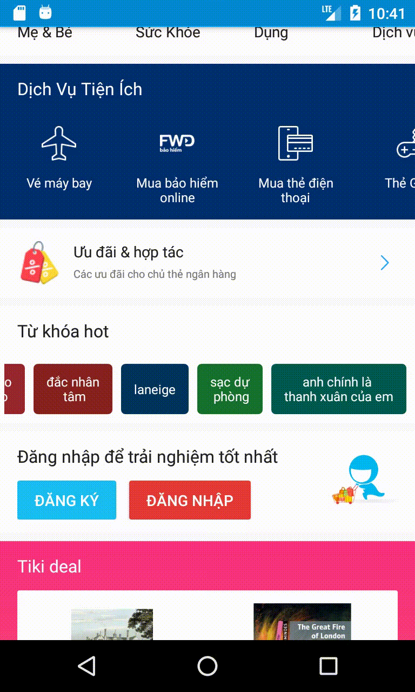

# Tiki Test Interview
Create a simple Android project. Code to display the following keyword list as designed:

Requirement:

 * [ ] If the keyword is more than one word, then display in two lines. These two lines should have minimum difference in length. For example: "nguyễn nhật ánh" should be "nguyễn\nnhật ánh", not "nguyễn nhật\nánh". Because difference in length of "nguyễn" and "nhật ánh" is less than difference in length of "nguyễn nhật" and "ánh".
 * [ ] Keywords must be fetched from the [link](https://raw.githubusercontent.com/tikivn/android-home-test/v2/keywords.json)

## Screenshots
- ### Home screen 1: 
- ### Home screen 2: 
- ### Home screen 3: 
